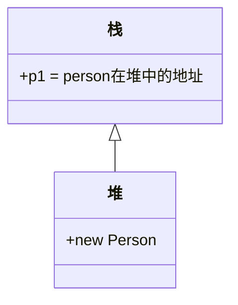
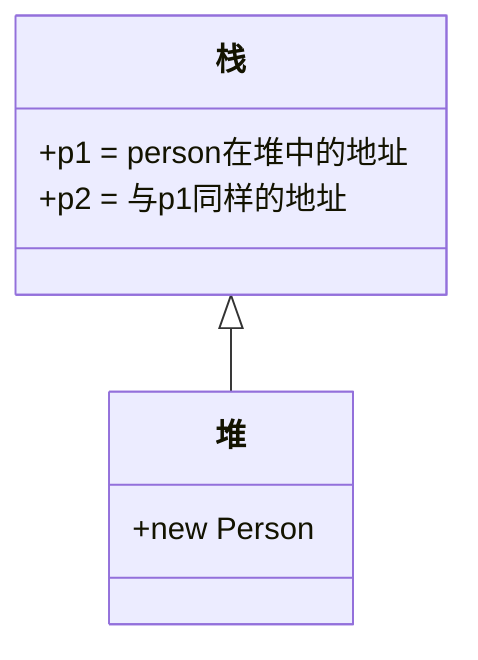

# 装箱和拆箱

## 概念&描述

- 装箱:将值类型转换为引用类型
- 拆箱:将引用类型转换为值类型

不论是装箱还是拆箱，效率都较为低下，因此在实际项目中应当尽量避免大规模的出现装箱&拆箱代码

### 案例

为了更好理解装箱和拆箱使用以下一个案例来理解:

```c#
using System;

namespace _BoxExample
{
    internal class Example
    {
        static void Main(string[] args)
        {
            //装箱
            int x1 = 1;
            object y1 = x1;

            //拆箱
            int x2 = (int)y1;
        }
    }
}
```

### 触发条件

只有当两种类型存在继承关系时，才有可能发生装箱&拆箱操作

例如:

```c#
string s = "1221";
int n = Convert.ToInt32(s);
```

将string转为int并没有发生装箱与拆箱操作，因为他们不存在继承关系

当发生[案例](##案例)情况时，int类型(子)与object(父)是继承关系，因此触发了装箱与拆箱操作

# 字典(键值对集合)

使用字典集合必须调用`System.Collections.Generic`才能运作

以下是创建一个字典集合的案例:

```c#
using System;
using System.Collections.Generic;

namespace _DictionaryExample
{
    internal class Example
    {
        static void Main(string[] args)
        {
            Dictionary<int,string> adic = new Dictionary<int,string>();//创建一个字典集合对象
        }
    }
}
```

这样我们创建了一个名字为`adic`的字典集合

## 作用

使用字典集合有一个很好的好处，能够控制键和值的类型，比如举例创建的对象便是要求`adic`集合的键一定是`int`类型，而值一定要是`string`类型

这样能够方便的管理对象的键，让其内容控制在合理范围内

## 调用方法

各类方法(函数)与HashTable一致，包括`Add()`与通过键赋值等

但是其遍历方式可以有些不同

### 遍历访问

同样使用`foreach()`循环，但是参数不一样

通过`KeyValuePair<>`来获得`adic`字典的键与值

```c#
using System;
using System.Collections.Generic;

namespace _DictionaryExample
{
    internal class Example
    {
        static void Main(string[] args)
        {
            Dictionary<int,string> adic = new Dictionary<int,string>();//创建一个字典

            adic.Add(1, "121");
            adic.Add(2, "889");
            adic.Add(3, "198");

            adic[1] = "233";

            //普通在Hashtable中使用的foreach遍历方式
            foreach (var item in adic.Keys)
            {
                Console.WriteLine("{0}>{1}", item, adic[item]);
            }

            //同样使用foreach但是不同参数的遍历方式
            foreach (KeyValuePair<int,string> kvp in adic)
            {
                Console.WriteLine("{0}-->{1}", kvp.Key, kvp.Value);
            }
        }
    }
}
```


# FileStream文件流

前面使用File类对文件进行操作都是一次性的，对内存会造成较大负荷，因此需要使用FileStream来进行这些操作


## 概念/区别

FileStream需要搭配StreamReader&StreamWriter使用

- FileStream用于操作字节
- StreamReader&StreamWriter用于操作字符

### File与FileStream的区别

以两个水缸举例，一个水缸的水要倒到另一个水缸，有两种方法(固定思维):

- 一勺一勺的挖，不费力但是需要长时间——FileStream
- 直接扛起来倒入另一个水缸——File

 

## 上手

创建FileStream需要调用`System.IO`

### 创建对象(FileStream)

通过以下代码来创建一个实例对象

```c#
using System;
using System.IO;//调用需要的命名空间
using System.Text;

namespace _FileStreamExample
{
    internal class Example
    {
        static void Main(string[] args)
        {
            FileStream FSRead = 
            new FileStream(@"D:\64\FileStreamExample_01.txt",FileMode.OpenOrCreate,FileAccess.ReadWrite);
            //设置访问路径，选择打开方式，需要进行的数据操作
        }
    }
}
```

其中

```c#
FileStream FSRead = new FileStream(@"D:\64\FileStreamExample_01.txt",FileMode.OpenOrCreate,FileAccess.ReadWrite);
```

的构造函数

`FileStream(string path,FileMode,FileAccess)`分别设置了文件所在路径、打开的方法与文件数据处理方法(权限)

### 设置读取缓存区(FileStream)

通过`Read()`方法来设置读取缓存用的字节数组等参数，并且**会返回**在本次读取中实际占用的有效字节数

```c#
//设定读取缓存区域
byte[] FSRead_Cache = new byte[1024*1024*5];//设定缓存字节数组空间为5M
/设置了缓存用的字节数组、在字节数组中写入的起始偏移(通常为0)与最大缓存区域
FSRead.Read(FSRead_Cache,0,FSRead_Cache.Length);
```

而后这个方法会返回一个int类型数据

### 将字节数组中的内容解码(Encoding)

通过`Encoding`将字节数组的内容解码并存入字符串中

```c#
string s = Encoding.Default.GetString(FSRead_Cache,0,r);
```

### 关闭文件流和释放资源(FileStream)

通过`Close()`方法关闭文件流，`Dispose()`方法释放资源

```c#
FSRead.Close();//关闭文件流
FSRead.Dispose();//释放资源
```


### 写入文件与自动关闭&释放资源(FileStream&using)

做到自动关闭与自动释放资源需要让整个FileStream在`using(){}`框架内

以下是一个例子:

```c#
			//通过FileStream写入文件，并且通过using自动关闭
            using(FileStream FSWrite = new FileStream(
                    @"D:\64\FileStreamExample_01.txt", FileMode.OpenOrCreate,FileAccess.ReadWrite)
                 )
            {
                //准备写入的内容
                string need_write = "12138";
                //设定缓存字节数组空间为5M
                byte[] FSWrite_Cache = Encoding.UTF8.GetBytes(need_write);
                FSWrite.Write(FSWrite_Cache,0,FSWrite_Cache.Length);
            }
            Console.WriteLine("Write Success");
```


# StreamReader & StreamWriter

## StreamReader

通过以下代码新建对象

```c#
StreamReader readAfile = new StreamReader(@"D:\64\S1.txt",Encoding.Default)
```

使用`Encoding.Default`来确保编码正确


## StreamWriter

通过以下代码新建对象

```c#
StreamWriter writeAfile = new StreamWriter(@"D:\64\new.txt")
```

可以在创建对象时确认是否要在写入时覆盖源文件还是叠加源文件

```c#
StreamWriter writeAfile = new StreamWriter(@"D:\64\new.txt",true)//覆盖
```


# 多态

- 概念:让一个对象表现出多种状态(类型)

## 举例

- 先创建一个父类，里面要有一个方法、一个字段和一个带参数构建方法，而后创建2个以上基于该父类的之类，除了构建方法带上`:base()`以外，同时写一个具有标志性的方法与父类方法重名

```c#
//创建子对象
SubExample s1 = new SubExample("hi");
SubExample s2 = new SubExample("hi2");
TrdExample t1 = new TrdExample("hello");
TrdExample t2 = new TrdExample("hello2");
//将其放入父类数组
Example[] es = {s1,s2, t1, t2};
```


如果在一般的时候，将这些对象放入父类的数组中，其读取出来都是父类的对象，调用也是父类的资源，需要通过以下代码强转后调用

```c#
for (int i = 0; i < es.Length; i++)
            {
                if(es[i] is SubExample)
                {
                    ((SubExample)es[i]).WhoAmI();
                }else if(es[i] is TrdExample)
                {
                    ((TrdExample)es[i]).WhoAmI();
                }
            }
```


这样未免过于繁琐了，因此需要以下方法实现一个对象多种状态以供调用

## 实现多态

实现多态有三种方法

1. 虚方法
2. 抽象类
3. 接口

## 虚方法

- 解决方案:在调用状态为父类的子类对象(即意为改对象会调用父类的方法而不是子类的方法)方法，让其父类的方法自动调用子类的方法即为虚方法

### 实现方法

1. 方法实现方法类方法标记为虚方法，使用关键字`virtual`，即意为允许子类将该方法重写
2. 在要覆写的子类方法写入关键字`override`，即表示子类会将该同名的并且标记了`virtual`的方法重写

## 抽象类

由于部分子类不适合做父类(比如猫和狗，都有叫的需求，但是两个都不适合做父类)时，可以使用抽象类来实现多态

当然也可以用于在父类中的方法不清楚要哪些时，可以将父类写成抽象类，将方法写成抽象方法

- 抽象方法存在的意义是为了在父类无法确认(不知道父类的意义时)如何实现方法时让子类重写方法

> 抽象类禁止创建对象(无意义因此禁止)

- 解决方案:在通过`Animal(一个抽象父类) aDog = new Dog();(Dog是一个子类)`创建对象时，Dog属于Animal类，并且调用的`Brak()`——在父类中的抽象类方法和子类的重名方法(并且已使用override标记覆写)时，依旧调用的是Animal的抽象方法，但是由于是抽象方法并且有override标记因此被覆写掉是Dog中的`Brak()`方法

### 实现

1. 可以将一个类标记为抽象类，在创建类时通过`abstract`关键字标记为抽象类
2. 方法也是通过`abstract`关键字标记为抽象方法

> 注意，抽象方法不允许有方法体


### 抽象类与虚方法的对比

> 抽象类和虚方法的区别
>
> > - 虚方法的父类已经有了实现，而抽象类的父类中的重名方法没有实现
>
> 抽象类
>
> > - 抽象类可以创建非抽象类属性和方法与构造函数，不过由于其是抽象类因此无法创建对象，但是这些属性和方法可以提供给子类使用
> >- 抽象成员只能存在于抽象类中，并且不可`private`
> > - 抽象类不可实例化
> >- 当子类也是抽象类时子类不需要实现父类方法和成员
> > - 抽象类中的方法在正常子类中必须实现，并且如果有返回值&传入参数也必须拥有


### 抽象属性

在抽象类中新建属性时使用`abstract`标记即可生成抽象属性


## 抽象类与虚方法

抽象类能够与虚方法兼容，在抽象类中可以创建一个虚方法，并且虚方法可以写方法体，两者可共存与覆写

# 访问修饰符补充

通过访问修饰符来控制哪些位置可以读取这个属性

## 例表

| **访问修饰符** | **可用于**  | **可被哪些位置访问**                       |
| -------------- | ----------- | ------------------------------------------ |
| public         | class,other | 解决方案中的任意位置                       |
| internal       | class,other | 可被当前程序集 *(in Java is Package)* 访问 |
| protected      | other       | 只能被当前类内部和该类子类访问             |
| private        | other       | 只能被当前类内部访问                       |

> 子类的访问权限不能高于父类的访问权限    *——因为会暴露父类成员*


# 设计模式

- 设计项目的方式，用于解决项目中的难题，共计有23种设计模式

## 简单工厂设计模式

以生成笔记本为例，笔记本分为各种牌子，而只有用户知道用户需要哪个牌子的笔记本，但是工厂不能停工，为了适应用户需求可以一直生产笔记本(各个牌子的父类)，用户选择后将子类笔记本其打包在父类对象中给用户

### 案例

具体参考**06-工程设计模式**项目


# 值传递和引用传递

- 值:例如`int`/`double`/`char`/`bool`/`enum`等类型属于值
- 引用:例如`string`/`数组`/`object`/`集合`/`自创建对象`/`接口`等

值类型会存储在栈内，引用类型会存储在堆内

## 值传递

一次标准的值传递

```c#
int n1 = 10 ;
int n2 = n1 ; 
n2 = 20 ;
Console.WriteLine("{0}\n{1}"n1,n2);
```

控制台将输出

```cmd
10
20
```

其中n1的值是存储在栈内，而n2是从n1复制然后存储在一个新的栈内，因此传递的是这个值本身而不是n2指向n1

## 引用传递

而在引用类型是另一种情况，按以下代码为例

```c#
//Person是一个预先写好的类，有name这一个属性，并且name是公开的
Person p1 = new Person();
p1.name="AB";
Person p2 = p1;
p2.name="CD";
Console.WriteLine(p1.name);
```

此时控制台将会打印

```cmd
CD
```

由于引用类型在复制的时候，传递的是对这个对象的引用



当执行到`Person p2 = p1;`时



当`p2.name="CD"`时，堆中对应的地址被修改，而由于p1和p2共用一个地址，因此`p1.name`也被修改

> 但是String是例外，由于字符串是不可变性变量，因此在执行上述自定义类的操作时，String并不会发生改变


## ref关键字

众所周知在值传入方法后，如果在方法内改变而不返回返回值的话外部的变量依旧不会变，因为他们在栈中地址不一样

而在值使用`ref`时并调用方法后，两个值(外部变量和方法内的变量)在栈中的地址便是一样的了


# 序列化与反序列化

- 序列化:将对象转换为二进制
- 反序列化:将二进制转换为对象
- 作用:传输数据

## 序列化

1. 如果需要序列化对象，需要将该类标记为可序列化的对象，需要在类的上一行标记`[Serializable]`，而后该类禁止被继承
2. 开始序列化前还需要调用`System.Runtime.Serialization.Formatters.Binary;`来引入相关方法与对象
3. 而后新建一个`BinaryFormatter`对象，通过`Serialize`方法将其序列化
4. 噢，`Serialize`还需要一个`Stream`对象用于传输与存储，因此可以新建一个`FileStream`对象来存储，记得填地址和给权限
5. 而后运行，将会写入与文件流对象实例化的文件

## 反序列化

1. 依旧需要序列化对象`BinaryFormatter`，而后调用`Deserialize`方法，然后会返回一个Object类型
2. 通过 `变量名 = (要强转的类型)BinaryFormatter对象名.Deserialize(FileStream流)`来读取对象并转换为相应类型


# 部分类

当在同一`namespace 命名空间`下时，会由于共同开发等原因需要写重名类，若要避免重名造成的名称冲突可以在类前加上关键字`partial`

## 特性

- 两个同名类被打上`partial`标签后，可以共存
- 这两个类可以互相访问所有字段，包括`private`权限的变量

- 部分类内依旧**禁止**有重名但是不重载的方法


# 密封类

- 在类前加入关键字`sealed`即可标记该类为密封类


## 特性

- 禁止继承(派生)
- 密封类可以继承其它非密封类

 

# 重写`ToString()`方法

由于正常情况下`ToString（）`方法转换为`String`后是直接打印对象名称

因此需要重写`ToString`方法来使用

> 与`ToString()`方法一样基于`Object`类可能需要重写的方法还有`Equals()`方法和`GetHashCode()`方法


# 接口

 接口是实现[多态](#多态)的第三种方法

## 适用案例

- 例现有三个类，分别是Person、NBA Player、Student，Student继承于父类Person而NBA Player是单独一个类，此时Student类想要使用NBA Player类中的方法，此时除了让NBA Player是Person的子类然后Student是NBA Player的子类以外，还能由NBA Player这个类提供接口用于重写

## 如何实现接口

按以下代码为例

```c#
	public class Person
    {
        public void SayHello()
        {
            Console.WriteLine("Hi");
        }
    }

    public class NBAPlayer
    {
        public void PlayBasketball()
        {
            Console.WriteLine("Bong");
        }
    }

    public class Student:Person
    {
        public void Study()
        {
            Console.WriteLine("Study");
        }
    }
```

Student已继承Person类，此时想要NBA Player的`PlayBasketball()`方法

添加`interface`

```c#
	public interface IPlayBasketballable{
		void PlayBasketball();
	}
```

而后在Student类中添加接口

```c#
	public class Student:Person,IPlayBasketballable
```

再在Student类内重写`PlayBasketball()`方法

```c#
	public void PlayBasketball(){
		....
	}
```

## 为何是接口

- 接口一般用在已有父类的情况下还需要更多方法来重写，此时即可使用接口
- 接口也是一种规范、能力

## 语法

通过以下方法声明一个接口

```c#
	[public] interface (I(名称)able){
		成员
	}
```

- 接口中的成员不允许添加访问修饰符，默认为`public`
- 接口中的方法没有方法体，也不能包含有方法体的方法
- 接口中不能有字段，但是可以有[自动属性](#自动属性)

## 特性

- 如果有类继承了接口则这个类必须实现接口的所有属性
- 接口不可被实例化
- 接口不能继承类(类可以继承接口)，但是能继承多个接口，并且不用在新的接口中重写


## 显示实现接口

当类内有方法与接口内的方法重名时，会被认为类内重名的方法是接口的方法重写，此时需要指明是接口的方法进行重写

- 以之前的Student、NBA Player与Person为例，新建Teacher类

```c#
public class Teacher : Person, IPlayBasketballable 
    { 
        public void PlayBasketball(string height)
        {
            Console.WriteLine(height);
        }

        public void IPlayBasketballable.PlayBasketball(string height)
        {
            Console.WriteLine("too");
        }
    }
```

通过`接口名.方法名`来重写特定接口的方法

> 若要调用接口内的方法，可以通过创建接口对象，实例为子类的初始化来使用接口内方法

# 自动属性

通过以下方法声明一个自动属性

```c#
	string name{
		get;
		set;
	}
```

> 自动属性即为自动生成私有字段，并且写法不同，没有字段没有方法体，因此也不允许限定属性 (因为少了限制的方法体)


# GUID

GUID能产生一个独一无二的编号

```c#
Guid name = Guid.NewGuid();
//or
Guid.NewGuid();
name.ToString();//转字符串
```

以上即可

# MD5

如何进行MD5加密，通过以下方法即可

```c#
        public static string GetMD5(string str)
        {
            //创建MD5对象
            MD5 md5 = MD5.Create();
            //加密
            
            //先将string转为字节数组
            byte[] buffer = Encoding.Default.GetBytes(str);
            //返回已加密的字节数组
            byte[] result = md5.ComputeHash(buffer);
            //再将字节数组转为字符串
            string reback = "";
            for (int i = 0; i < result.Length; i++)
            {
                reback += result[i].ToString("x");
            }
            return reback;
        }
```

需要注意 

1. md5加密后的字节数直接将其中元素使用`toString()`转换即可，不需要进行转码，但是MD5加密需要将字符串转成字节数组
2. 在`ToString()`方法中填入字符串`"x"`即可将其转为16进制内容(默认10进制)
